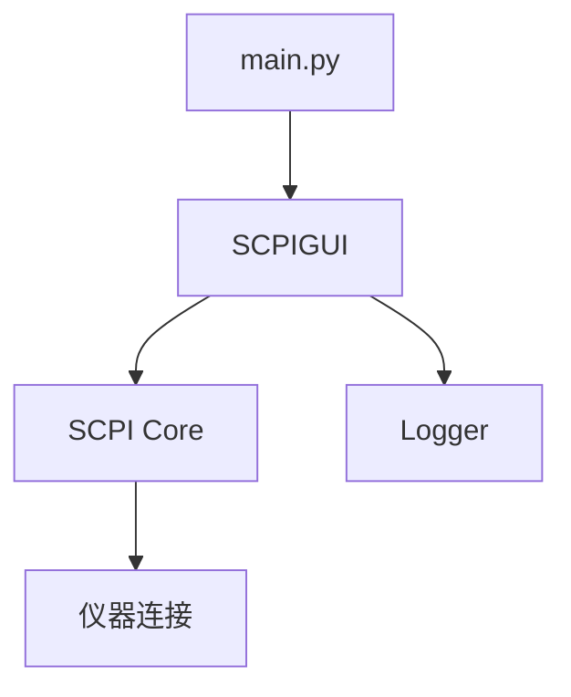

# SCPI Command Sender

SCPI Command Sender 是一个基于 PyQt5 开发的图形化工具，用于向支持 SCPI（Standard Commands for Programmable Instruments）协议的仪器发送命令。该工具提供了直观的用户界面，支持命令预设管理、批量执行和日志记录等功能。

## 功能特点

### 1. 连接管理

## 项目结构

```
.
├── main.py                # 应用入口
├── scpi_app/              # 核心代码
│   ├── core/              # SCPI核心功能
│   │   ├── scpi.py        # SCPI协议实现
│   │   └── logger.py      # 日志功能
│   └── gui/               # GUI实现
│       └── scpi_gui.py    # PyQt5界面
├── config/                # 配置文件
├── logs/                  # 日志文件
└── output/                # 输出目录
```

## 系统架构



### 1. 连接管理
- 支持通过 TCP/IP 连接到仪器
- 自动获取并显示仪器标识信息
- 实时显示连接状态

### 2. 命令管理
- 支持添加、编辑、删除和重排序 SCPI 命令
- 内置常用命令预设
- 支持导入/导出自定义预设配置
- 支持命令序列的批量执行

### 3. 执行控制
- 可设置命令执行的重复次数和间隔时间
- 实时显示命令执行状态和结果
- 支持长时间运行的命令序列

### 4. 日志功能
- 自动记录所有操作和响应
- 按日期生成日志文件
- 支持多级别日志（INFO、WARNING、ERROR）
- 实时显示执行输出

## 安装说明

### 环境要求
- Python 3.6 或更高版本
- PyQt5
- 支持 Windows/Linux/macOS

### 安装步骤

1. 克隆或下载项目代码
```bash
git clone https://github.com/your-username/SCPI-Command-Sender.git
cd SCPI-Command-Sender
```

2. 安装依赖
```bash
pip install -r requirements.txt
```

## 使用方法

### 启动程序
```bash
python main.py
```

### 基本操作流程

1. 连接仪器
   - 输入仪器的 IP 地址和端口
   - 点击"连接"按钮建立连接
   - 连接成功后将显示仪器信息

2. 添加命令
   - 直接在命令输入框中输入 SCPI 命令并点击"添加"
   - 或从预设列表中选择预定义的命令序列
   - 可以通过上下移动按钮调整命令顺序

3. 执行命令
   - 批量循环执行命令序列
     - 设置执行次数和间隔时间
     - 点击"循环执行命令"开始执行
     - 在输出区域查看执行结果
   - 单次执行
     - 输入命令
     - 点击"直接发送"执行命令

4. 预设管理
   - 使用"加载预设"导入已保存的命令序列
   - 使用"保存预设"将当前命令序列保存为预设
   - 预设文件使用 JSON 格式存储

### 内置预设说明

1. Basic Query
   - 基本查询命令
   - 包含 `*IDN?`, `*OPT?`, `*STB?` 等标准查询命令

2. Clear and Run
   - 清除并运行采集
   - 包含清除状态、清屏和启动采集等命令

3. Measurement Setup
   - 测量设置
   - 包含通道选择和各种测量参数查询命令

## 日志说明

- 日志文件保存在 `logs` 目录下
- 按日期生成独立的日志文件（格式：SCPI_Log_YYYYMMDD.log）
- 记录所有操作、响应和错误信息
- 包含详细的时间戳和日志级别

## 注意事项

1. 连接安全
   - 确保仪器和电脑在同一网络中
   - 检查仪器的 SCPI 服务是否已启用
   - 确保防火墙允许相应端口的通信

2. 命令执行
   - 执行命令前请仔细检查命令格式
   - 注意查询命令（以 ? 结尾）和设置命令的区别
   - 建议先使用较小的重复次数测试命令序列

3. 错误处理
   - 程序会自动记录错误信息到日志文件
   - 界面会显示错误提示
   - 连接错误时会自动断开并重置状态

## 贡献指南

欢迎提交问题报告和改进建议！如果你想贡献代码：

1. Fork 本仓库
2. 创建你的特性分支 (`git checkout -b feature/AmazingFeature`)
3. 提交你的改动 (`git commit -m 'Add some AmazingFeature'`)
4. 推送到分支 (`git push origin feature/AmazingFeature`)
5. 创建一个 Pull Request

## 许可证

本项目采用 MIT 许可证 - 详见 [LICENSE](LICENSE) 文件